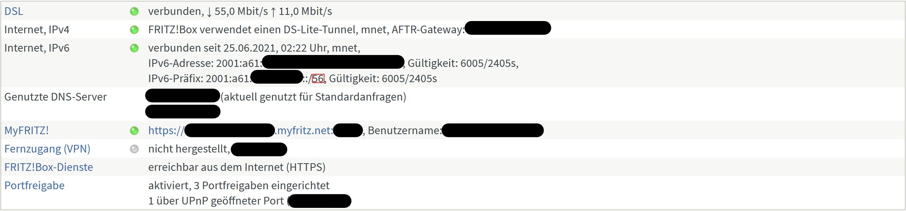
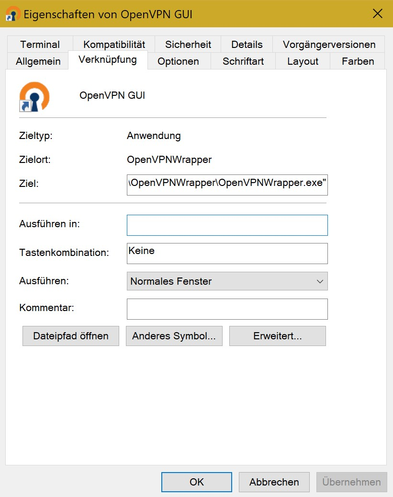
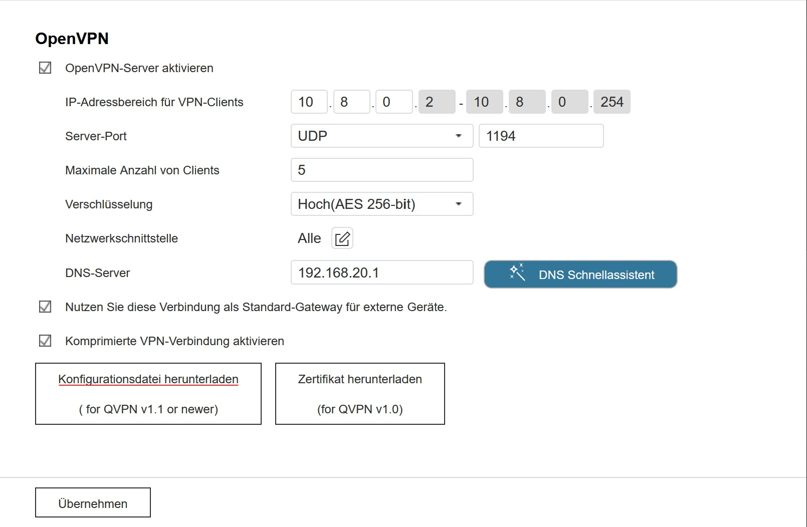
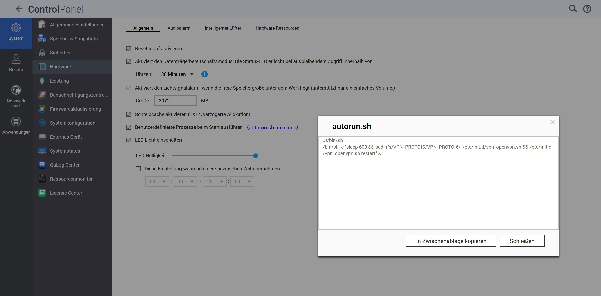

# OpenVPNWrapper
Wrapper for OpenVPN to update configuration scripts for access
to NAS systems with IPv6 addresses behind DS-Lite routers.

## Executive Summary

### What does OpenVPNWrapper do?

OpenVPNWrapper is a tiny tool for Windows 10, allowing you to connect to a NAS behind an
DS-Lite tunnel for VPN accessibility. It therefore resolves the IPv6 address of the NAS
from a DDNSv6 server for the router, as this would be the case for classical IPv4 NAT
gateway port forwarding. This resolves the problematic case in which you cannot access
neither the router nor the NAS to connect to via IPv4, as you were only provided with a
DS-Lite tunnel by your network provider.

### How is OpenVPNWrapper achieving this?

OpenVPNWrapper uses the public IPv6 address of your router and cuts off the interface
identifier of the router to replace it with the interface identifier of your NAS. It then
updates the OpenVPN configuration script to connect to your NAS with its correct address,
which may change daily due to network provider compulsory separation.

### What are the prerequisites for OpenVPNWrapper?

You need to know:
* Is there a subnet your router places your NAS into (e.g. 01)?
* What is the length of your IPv6 routing prefix (e.g. 48, 52, 56, 60 or 64)?
* What is the interface identifier of your NAS?

You need to provide:
* DDNSv6 server to resolve the IPv6 address of your router
* NAS capable to function as OpenVPN server

### Where can I find the information in order to fulfill the prerequisites?

Let's start bottom up:
* NAS capable to function as OpenVPN server\
	You are able to install a OpenVPN server by your own on various devices
	(https://openvpn.net/community-resources/how-to/). However, you most likely want to
	keep the efforts low and therefore use existing implementations. There may be a little
	research necessary to provide a complete list of NAS manufacturers offering a OpenVPN
	server implementation, however, e.g. Synology or QNAP devices are often providing this
	functionality.
* DDNSv6 server to resolve the IPv6 address of your router\
	There are many providers for DDNS services also capable of IPv6, which come up with
	different prices. Nevertheless, router manufacturers sometimes also offer this service
	for free, e.g. Netgear or AVM.
* Interface identifier of your NAS\
	Usually, you can get the IPv6 address of your NAS by opening its web interface and
	searching in the settings for IPv6. If the OS of your NAS is Linux-based (which might
	be common, don't quote me on that) and you have SSH access enabled, you can also check
	for the IPv6 address via command line, which is usually marked with *Global* when able
	to be accessed globally.	
	```sh
	ifconfig | grep Global
	```
	The interface identifier consists of the last 4 blocks of your IPv6 address (e.g.
	```::0123:4567:89ab:cdef``` for output:
	```inet6 addr: 2001:a61:0403:0201:0123:4567:89ab:cdef/64 Scope:Global```)
* Length of IPv6 routing prefix\
	You can obtain information about the length of the IPv6 routing prefix usually via
	the web interface of the router. In the example image below the routing prefix is set
	to 56 (see red frame):
	
* Subnet of NAS device\
	The subnet of the NAS device is assigned from the router depending on the address
	range still available. In the both examples above the IPv6 address of the NAS was
	```2001:a61:0403:0201:0123:4567:89ab:cdef``` while the length of the IPv6 routing
	prefix was ```56```. The relevant block of the IPv6 address in order to determine
	the subnet is the fourth block from left (```0201```). It is most likely that the
	router always assigns the same subnet 	to your device as long as you are not changing
	any settings. The script used to resolve the IPv6 address of the NAS currently
	supports the following routing prefix lengths, which always result to different subnet
	lengths (the length of routing prefix plus the length of subnet must always be 64):
	
    | Length of routing prefix | Length of subnet | Subnet according to examples provided |
    | ------------------------ | ---------------- | ------------------------------------- |
    | 64 bits                  | 0 bits           | -                                     |
    | 60 bits                  | 4 bits           | 1 (Binary: 0001)                      |
    | 56 bits                  | 8 bits           | 01 (Binary: 0000 0001)                |
    | 52 bits                  | 12 bits          | 201 (Binary: 0010 0000 0001)          |
    | 48 bits                  | 16 bits          | 0201 (Binary: 0000 0010 0000 0001)    |

## Installation Guide

### Run pre-compiled program

Download the [Program](Program) folder and unzip it. In this folder you will see 7 files in
total of which one is the program itself (*.exe*) and one is a PowerShell script (*.ps1*).
The program is based on the .NET 4.8 framework which should be installed by default on your
Windows 10 version. If the application does not start due to the missing framework, you
may [install](https://dotnet.microsoft.com/download/dotnet-framework/net48) it directly
from Microsoft.

Install OpenVPN if not done yet in order to connect to the NAS once the setup is done
(https://openvpn.net/community-downloads/). Choose therefore the *Windows ... MSI Installer*.

Place the entire OpenVPNWrapper folder at the location of your desire, preferably inside
the start menu folder of the OpenVPN in Windows (e.g. as ```OpenVPNWrapper``` folder in
```C:\ProgramData\Microsoft\Windows\Start Menu\Programs\OpenVPN```). 
You may also change the link destination of *OpenVPN GUI* from the OpenVPN program itself
to the OpenVPNWrapper, as the wrapper will call OpenVPN once the IPv6 address resolution
is finished. Therefore, right click on *OpenVPN GUI* and change the destination to
```C:\ProgramData\Microsoft\Windows\Start Menu\Programs\OpenVPN\OpenVPNWrapper\OpenVPNWrapper.exe```
as shown in the image below.



Enable OpenVPN on your NAS. Make sure that IPv6 for OpenVPN is supported by your NAS
(for QNAP, [which does not support IPv6 VPN officially], you can use a workaround which
will be explained further on [later](#enabling-ipv6-openvpn-on-qnap)). Download the
OpenVPN configuration file from the NAS and store it in the *config* folder of OpenVPN
(```C:\Program Files\OpenVPN\config```):


For the first run, you need to update the configuration script manually. Therefore, open
the configuration file and update the IP address in the ```remote``` line accordingly,
for example: ```remote 2001:a61:0403:0201:0123:4567:89ab:cdef 1194```. Furthermore,
change the section ```proto udp``` to ```proto udp6```. Your configuration file should
now look somewhat like this:
```
client
dev tun
script-security 3
remote 2001:a61:0403:0201:0123:4567:89ab:cdef 1194
resolv-retry infinite
nobind
auth-nocache
auth-user-pass
remote-cert-tls server
reneg-sec 0
cipher AES-256-CBC
tls-cipher TLS-ECDHE-RSA-WITH-AES-256-GCM-SHA384:TLS-ECDHE-ECDSA-WITH-AES-256-GCM-SHA384:TLS-DHE-RSA-WITH-AES-256-GCM-SHA384:TLS-DHE-RSA-WITH-AES-256-CBC-SHA256:TLS-DHE-RSA-WITH-AES-256-CBC-SHA:TLS-DHE-RSA-WITH-AES-128-CBC-SHA
comp-lzo
proto udp6
explicit-exit-notify 1
<ca>
-----BEGIN CERTIFICATE-----
...
-----END CERTIFICATE-----
</ca>
```

Now, update the PowerShell script ```ResolveIPv6.ps1``` in the OpenVPNWrapper folder with
all the information you gathered yet. You may edit the script with any text editor.
```powershell
# Address of the DDNSv6 server
$ddnsName = "example.myfritz.net"
# Size of the routing prefix
$netSize  = 56
# Subnet of the device 
$subnet   = "01"
# Interface identifier of the device to connect to
$itfIdent = "0123:4567:89ab:cdef"
# Location of the configuration file
$ovpnFile = "C:\Program Files\OpenVPN\config\NAS01.ovpn"
```
The variable ```$ddnsName``` stores the web address of your DDNSv6 server, which needs to
be updated onto your address.

The ```$netSize``` is the length of your IPv6 routing prefix you previously retrieved.

```$subnet``` is the net address assigned by your router. Please provide it in full form
with leading zeros according to your net size. Therefore, at a net size of 48 you should
define a 1 with 4 nibbles as ```0001```, at a net size of 60 with 1 nibble as ```1```.

The variable ```$itfIdent``` defines the interface identifier of your NAS and must be
stated accordingly without leading colons.

Finally, ```$ovpnFile``` states where to find your configuration file. The path should be
similar (if not stored inside your user folder), but the name of the file (in the example
case it is ```NAS01.ovpn```) needs to be actualized.

Now you are ready to go! The OpenVPNWrapper will resolve the IPv6 address of your NAS at
each start of the OpenVPN program, update the configuration file and open the OpenVPN GUI
afterwards.

### Enabling IPv6 OpenVPN on QNAP

In case you own a QNAP and want to connect via IPv6, you need to change the shell script
of OpenVPN inside ```/etc/init.d/vpn_openvpn.sh```. However, as QNAP runs an own embedded
version of Linux, all changes to this script are discarded after reboot. Therefore, you
need to apply changes to the ```autorun.sh``` in order to update the OpenVPN script after
each reboot. The OpenVPN server will then be restarted 10 minutes after reboot with UDP6
support. A script on how to achieve this is provided in the [QNAP](QNAP) folder (running
with QNAP firmware version 4.3.3 or newer, if you are running a QNAP with older firmware
version, see https://wiki.qnap.com/wiki/Running_Your_Own_Application_at_Startup).

Note that you still need to enable the execution of ```autorun.sh``` at startup. You can
activate this option by checking *Run user defined processes during startup* in 
*Control Panel > System > Hardware*:



This entry simply exchanges the ```proto ${VPN_PROTO}``` with ```proto ${VPN_PROTO}6``` in
the ```/etc/init.d/vpn_openvpn.sh``` script and restarts the service 10 minutes after the
device has booted. Similar to the change of ```proto udp``` to ```proto udp6```, this
adjustment enables accessing the OpenVPN server (your NAS) as well via IPv4 as via IPv6.

### Self-scripting and source code customization

If the solution provided does not fit your needs completely, feel free to adjust scripts
and source code at your will. The [code](Solution) is written in C# and licensed under
GPLv3. For compiling the source code you require the .NET Framework 4.8 Developer Pack to
be installed.

[which does not support IPv6 VPN officially]:https://forum.qnap.com/viewtopic.php?t=136396
